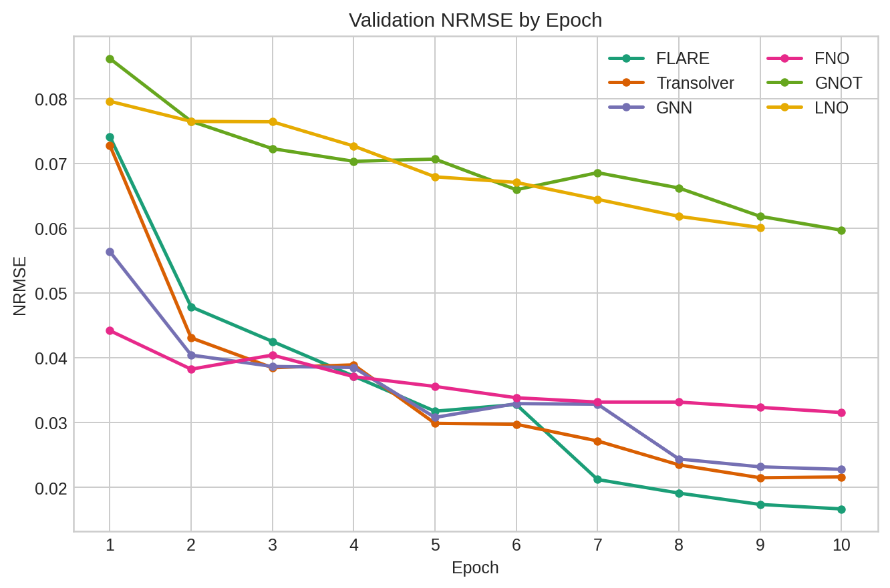
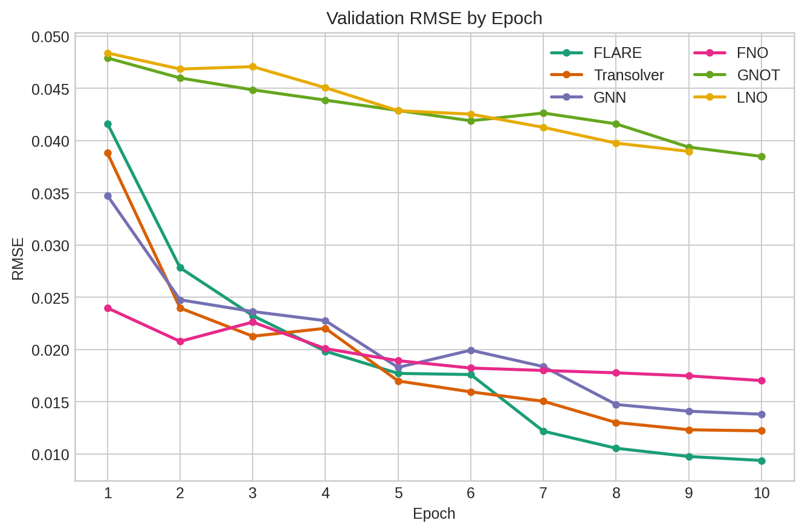

# Final Results

These values were re-checked against the saved `*_results.json` and `history.json` files for each final reported run.

Run sources:
- `flare`: `out/checkpoints/flare`
- `transolver`: `out/checkpoints/transolver`
- `gnn`: `out/checkpoints/gnn`
- `fno`: `out/checkpoints/fno`
- `gnot`: `out/checkpoints/gnot`
- `lno`: `out/checkpoints/lno`

Common setup:
- train/valid samples: `10000 / 1000`
- input/output steps: `1 / 1`
- epochs: `10`
- window stride: `10`
- device: `cuda`

### 1. Model and Training Parameters

| Model | Parameters | Architecture | Training Setup |
| --- | ---: | --- | --- |
| flare | 133,203 | `hd=48, L=3, heads=4, slices=32` | `lr=5e-4, min_lr=1e-5, wd=1e-5, clip=1.0, stride=10` |
| transolver | 136,467 | `hd=64, L=4, heads=4, slices=32` | `lr=1e-3, min_lr=1e-4, wd=1e-4, clip=1.0, stride=10` |
| gnn | 132,771 | `hd=72, L=4` | `lr=1e-3, min_lr=1e-4, wd=1e-4, clip=1.0, stride=10` |
| fno | 132,772 | `hd=16, L=4, modes=8, grid=32` | `lr=1e-3, min_lr=1e-4, wd=1e-4, clip=1.0, stride=10` |
| gnot | 140,867 | `hd=24, L=4, heads=4, slices=32` | `lr=1e-3, min_lr=1e-4, wd=1e-4, clip=1.0, stride=10` |
| lno | 144,739 | `hd=56, L=4, heads=4, slices=32` | `lr=5e-4, min_lr=5e-5, wd=1e-5, clip=0.5, stride=10` |

### 2. Training Behaviour

| Model | Train Loss | Valid Loss |
| --- | ---: | ---: |
| flare | 0.004285 | 0.004993 |
| transolver | 0.007152 | 0.008109 |
| gnn | 0.008825 | 0.009819 |
| fno | 0.062094 | 0.068865 |
| gnot | 0.255387 | 0.355921 |
| lno | 0.266147 | 0.365839 |

### 3. Results & Performance

| Model | Train NRMSE | Valid NRMSE | Train RMSE | Valid RMSE |
| --- | ---: | ---: | ---: | ---: |
| flare | 0.016107 | 0.016653 | 0.008540 | 0.009382 |
| transolver | 0.021331 | 0.021461 | 0.011401 | 0.012319 |
| gnn | 0.022241 | 0.022757 | 0.012824 | 0.013806 |
| fno | 0.030535 | 0.031537 | 0.015444 | 0.017029 |
| gnot | 0.055458 | 0.059688 | 0.033082 | 0.038479 |
| lno | 0.055567 | 0.060094 | 0.033543 | 0.038960 |

Sorted by validation NRMSE:
- flare
- transolver
- gnn
- fno
- gnot
- lno

## Training Curves

Epoch-by-epoch validation curves for the final reported runs:

Validation NRMSE:

Validation RMSE:

