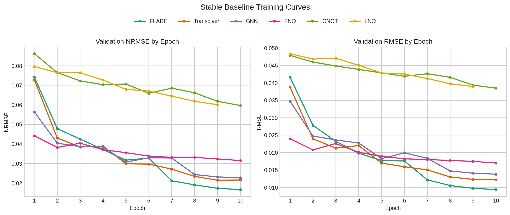

# Stable Results

These values were re-checked against the saved `*_results.json` and `history.json` files for each stable run.

Stable run sources:
- `flare`: `out/launch_oc3_flare`
- `transolver`: `out/launch_oc3_transolver`
- `gnn`: `out/launch_oc3_gnn`
- `fno`: `out/launch_oc1_fno`
- `gnot`: `out/launch_oc3_gnot`
- `lno`: `out/lno_stability_c`

Common setup:
- train/valid samples: `10000 / 1000`
- input/output steps: `1 / 1`
- epochs: `10`
- window stride: `10`
- device: `cuda`

| Model | Parameters | Hidden Dim | Best Epoch | Valid NRMSE | Valid RMSE | Train NRMSE | Train RMSE |
| --- | ---: | ---: | ---: | ---: | ---: | ---: | ---: |
| flare | 133,203 | 48 | 10 | 0.016653 | 0.009382 | 0.016107 | 0.008540 |
| transolver | 136,467 | 64 | 9 | 0.021461 | 0.012319 | 0.021331 | 0.011401 |
| gnn | 132,771 | 72 | 10 | 0.022757 | 0.013806 | 0.022241 | 0.012824 |
| fno | 132,772 | 16 | 10 | 0.031537 | 0.017029 | 0.030535 | 0.015444 |
| gnot | 140,867 | 24 | 10 | 0.059688 | 0.038479 | 0.055458 | 0.033082 |
| lno | 144,739 | 56 | 9 | 0.060094 | 0.038960 | 0.055567 | 0.033543 |

Sorted by validation NRMSE:
- flare
- transolver
- gnn
- fno
- gnot
- lno

## LNO Stability Check

The best saved LNO stability run is `out/lno_stability_c`.

| Run | Best Epoch | Valid NRMSE | Valid RMSE |
| --- | ---: | ---: | ---: |
| lno_stability_c | 9 | 0.060094 | 0.038960 |
| lno_stability_a | 10 | 0.062547 | 0.040287 |
| lno_stability_d | 9 | 0.065853 | 0.041888 |
| lno_stability_b | 10 | 0.075284 | 0.046323 |
| lno_stability_e | 4 | 0.075336 | 0.046559 |

Median LNO stability result:
- valid NRMSE: `0.065853`
- valid RMSE: `0.041888`

## Training Curves

Combined epoch-by-epoch validation curves for the stable runs:

